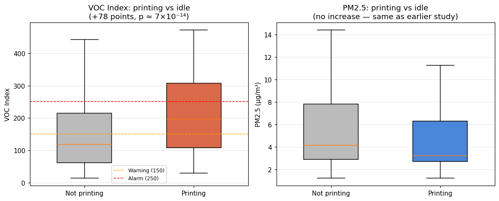
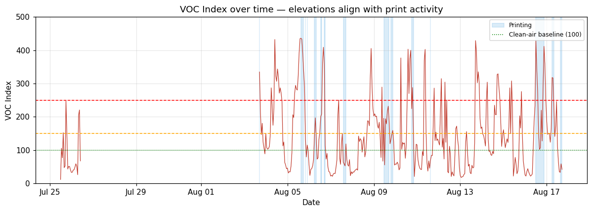

# Findings: 25 Days of Indoor Air Quality vs 3D Printing

This document summarises a 25-day study (16 May – 11 June 2026) using the monitor in this repo, correlating PM2.5 with Bambu Lab P2S printer activity. Full methodology and statistics are in the accompanying report.

> **TL;DR** — Printing PLA/PETG barely raised PM2.5 above the room's normal background, with or without the VentoBox filter. The biggest particulate events came from outside the printer (cooking / outdoor air). **But once the gas sensor was fixed, the picture changed: VOC rises sharply during printing (+78 index points, p ≈ 7×10⁻¹⁴) — a signal the particle sensor was completely blind to.**

---

## Setup at a glance

- **Sensors:** Sensirion SPS30 (PM1/2.5/4/10) + SGP41 (VOC/NOx) on an ESP32 (external antenna)
- **Pipeline:** ESP32 → MQTT → Telegraf → InfluxDB → Grafana, self-hosted on a Raspberry Pi
- **Printer link:** Bambu Lab P2S status pulled over its local MQTT API (nozzle/bed temp, print state, filtration fan speed)
- **Location matters:** the printer sits near the kitchen and a window — this turns out to be important

*PM2.5 over the full period with printing activity below. Most of the time the flat sat below the WHO 24-hour guideline (15 µg/m³).*

---

## Finding 1 — Printing barely moves PM2.5

Comparing PM2.5 while printing against the room baseline **within the same period** (so outdoor conditions are held roughly constant), printing added very little:

| Period | Printing median | Baseline median | Difference |
|--------|-----------------|-----------------|------------|
| No filter (16–24 May) | 6.7 µg/m³ | 6.1 µg/m³ | +0.6 (not significant, p = 0.18) |
| VentoBox (25 May–11 Jun) | 2.9 µg/m³ | 3.6 µg/m³ | −0.7 |

*In both periods the printing and not-printing distributions overlap heavily. The visible shift is **between periods**, not between printing and idle.*

## Finding 2 — The VentoBox benefit can't be isolated (an honest correction)

My first pass found a dramatic "−56% with the VentoBox" result. It was an artifact. The room baseline **with the printer switched off** was 6.1 µg/m³ in mid-May and 3.6 µg/m³ in June — the filter was off during those measurements, so it can't be the cause. Mid-May simply had dirtier outdoor air (daily baselines of 12–13 µg/m³ on 19–21 May).

*Room background with the printer OFF — driven by outdoor conditions, not the filter.*

**This does not mean the VentoBox is useless.** The SPS30 only sees particles above ~300 nm and measures no gases. FDM emissions are dominated by ultrafine particles (<100 nm) and VOCs — exactly what a HEPA + activated-carbon filter targets and what this sensor is blind to. The honest conclusion is: *for the PM2.5 this sensor can measure, in this well-ventilated room, the filter's effect is below the noise floor.*

## Finding 3 — PETG emits ~2× the PM2.5 of PLA

Filament type wasn't logged per-print, but nozzle/bed temperature is a clean proxy: PLA clustered at ~220 °C / 55 °C, PETG at ~250 °C / 70 °C (93% of prints classified confidently). Comparing within the VentoBox era, external spikes removed:

| Material | Median PM2.5 | Mean | p90 |
|----------|--------------|------|-----|
| PLA (~220 °C) | 1.7 µg/m³ | 2.7 | 6.0 |
| PETG (~250 °C) | 3.3 µg/m³ | 3.5 | 5.0 |

PETG's median is about double PLA's (p ≈ 2×10⁻¹⁸), consistent with its higher extrusion temperature — but both stayed at or below the room baseline.

## Finding 4 — The real spikes aren't the printer

Eight of the ten highest PM2.5 readings happened while the nozzle was cold. They cluster in the morning and evening — the classic signature of cooking and/or outdoor air entering through the window, given the sensor's location.

## Finding 5 — Gases tell a completely different story

The first phase had no usable VOC/NOx data. After fixing three separate faults (irregular 1 Hz sampling, a cold solder joint on the sensor's power pin, and transposed algorithm-type constants), a second dataset was collected 25 July – 17 August 2026.

This is where the interesting result lives:

| Channel | Printing | Idle | Difference | p |
|---------|----------|------|------------|---|
| **VOC Index** | 196 | 118 | **+78** | 7×10⁻¹⁴ |
| PM2.5 | 3.2 µg/m³ | 4.1 µg/m³ | −0.9 | 5×10⁻⁵ |
| NOx Index | 1 | 1 | 0 | — |

*The VOC distribution shifts strongly upward during printing; PM2.5 does not.*

During printing, VOC exceeded 150 **66% of the time** and 250 **36%** — but with the printer *off* those same thresholds were crossed 39% and 21% of the time. The elevation is real, but the distributions overlap heavily.

**Important — what VOC Index is not.** It's not a concentration. The SGP41 produces one signal responding to oxidisable gases collectively, and Sensirion's algorithm converts it to a 1–500 index where 100 = this room's own typical state over the past ~24h. So 200 means "more than usual here," not any µg/m³. VOCs are hundreds of compounds with wildly different toxicity (benzene is carcinogenic; limonene from citrus isn't), which is why **WHO publishes guidelines per compound, not for VOCs as a group** — no threshold here corresponds to a health standard.

The 150/250 thresholds were provisional values picked before any data existed. The data shows they're too low for this room: the idle distribution alone has a 90th percentile of **373**. Better thresholds would come from the room's own idle distribution (e.g. warning 373, alarm 432). That's a monitoring-config fix, not a health finding.

NOx stayed at baseline — expected, since FDM printing doesn't produce nitrogen oxides.

**What this means for the filter question:** Finding 2 concluded no PM2.5 benefit from the VentoBox could be demonstrated. The gas data confirms there genuinely *is* a gas-phase signal for an activated-carbon filter to work on. But it doesn't quantify the filter's effect — it ran at 100% continuously through this window, so there's no unfiltered comparison. That needs a deliberate on/off experiment.

**Material comparison stays inconclusive.** Classification was revised (nozzle temperature alone: 195–235 °C = PLA, 235–265 °C = PETG — the old rule requiring a 65 °C+ bed misclassified prints run at 245 °C with a 60 °C bed). In this window PLA had only 39 samples against 240 for PETG. Both raised VOC substantially (+100 and +76), but the difference between them wasn't significant (p = 0.07) and the imbalance is too large to conclude anything.

**Reliability after the fixes:** restarts fell from 29 in 25 days to **two in a month**.

---

---

## What the data could NOT show (and why)

- **VOC / NOx (phase 1):** values sat pinned at their initialisation baseline for the entire first dataset. Three faults were eventually found — irregular algorithm sampling, a cold solder joint intermittently cutting sensor power, and transposed algorithm-type constants. All fixed; results in Finding 5 below.
- **Device stability:** 29 restarts over the period. Diagnostic logging (heap, RSSI, CPU temp, boot reason) showed free heap rock-stable (never below 219 KB) — no memory leak. Restarts were interrupt-watchdog resets from occasional I2C/network blocking, now mitigated with an I2C timeout, bounded reconnects, and regular watchdog servicing.
- **No outdoor reference** sensor, so indoor-vs-outdoor attribution is inferred, not measured.

---

## Enclosure

The sensor lives in a custom 3D-printed enclosure (redesigned for better airflow across the SPS30 inlet/outlet and to keep the SGP41 exposed to room air). Printed on the same P2S it monitors.

<!-- TODO: add enclosure photo at docs/enclosure.jpg -->

---

## Takeaways

1. **Measure the right thing.** Particulates showed nothing; gases showed a clear signal. A PM-only monitor would have concluded "3D printing doesn't affect the air" — and missed the only channel that responds at all. (Whether that signal matters for health is a separate question this sensor can't answer.)
2. In a normally-ventilated room, FDM printing with PLA/PETG had a negligible effect on measurable PM2.5.
3. PETG roughly doubles PM2.5 vs PLA — still low in absolute terms. For VOC, no significant difference was found (small PLA sample).
4. A filter's PM2.5 benefit is hard to prove when printing adds so little to begin with. The gas data shows what it's actually for — but quantifying that needs a matched on/off experiment.
5. Honest measurement means controlling for confounders — the biggest "result" in v1 of this analysis turned out to be the weather.
6. **Log raw sensor signals, not just processed indices.** The gas-index algorithm is stateful and non-invertible, so a month of mislabelled data could not be recovered after the fact.

*Full report with complete statistics and methodology: see `Air_Quality_3D_Printing_Report.docx`.*
