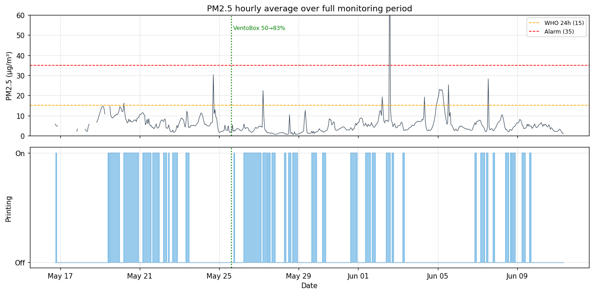
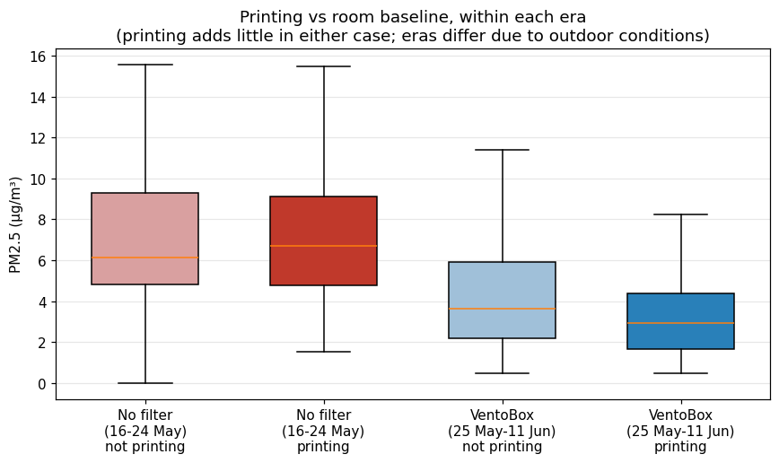
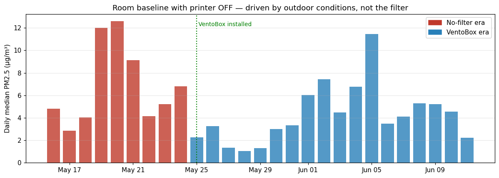
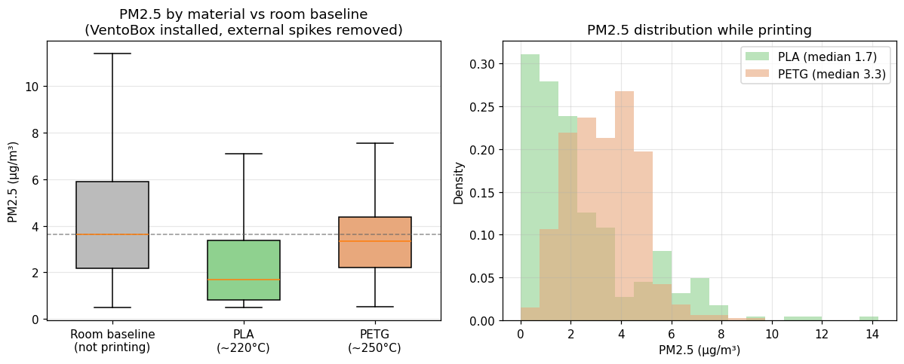
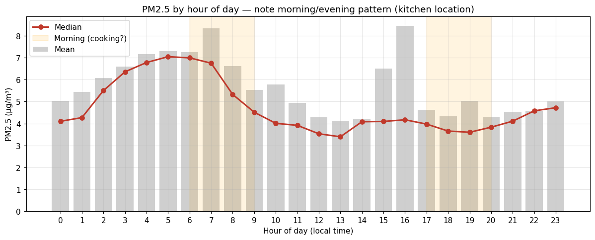

# Findings: 25 Days of Indoor Air Quality vs 3D Printing

This document summarises a 25-day study (16 May – 11 June 2026) using the monitor in this repo, correlating PM2.5 with Bambu Lab P2S printer activity. Full methodology and statistics are in the accompanying report.

> **TL;DR** — Printing PLA/PETG barely raised PM2.5 above the room's normal background, with or without the VentoBox filter. The biggest pollution events came from outside the printer (cooking / outdoor air). PETG emits about 2× the particulates of PLA, but both stayed at or below baseline. Gas-phase (VOC/NOx) data was lost to a firmware bug, now fixed — that's the next chapter.

---

## Setup at a glance

- **Sensors:** Sensirion SPS30 (PM1/2.5/4/10) + SGP41 (VOC/NOx) on an ESP32 (external antenna)
- **Pipeline:** ESP32 → MQTT → Telegraf → InfluxDB → Grafana, self-hosted on a Raspberry Pi
- **Printer link:** Bambu Lab P2S status pulled over its local MQTT API (nozzle/bed temp, print state, filtration fan speed)
- **Location matters:** the printer sits near the kitchen and a window — this turns out to be important

*PM2.5 over the full period with printing activity below. Most of the time the flat sat below the WHO 24-hour guideline (15 µg/m³).*

---

## Finding 1 — Printing barely moves PM2.5

Comparing PM2.5 while printing against the room baseline **within the same period** (so outdoor conditions are held roughly constant), printing added very little:

| Period | Printing median | Baseline median | Difference |
|--------|-----------------|-----------------|------------|
| No filter (16–24 May) | 6.7 µg/m³ | 6.1 µg/m³ | +0.6 (not significant, p = 0.18) |
| VentoBox (25 May–11 Jun) | 2.9 µg/m³ | 3.6 µg/m³ | −0.7 |

*In both periods the printing and not-printing distributions overlap heavily. The visible shift is **between periods**, not between printing and idle.*

## Finding 2 — The VentoBox benefit can't be isolated (an honest correction)

My first pass found a dramatic "−56% with the VentoBox" result. It was an artifact. The room baseline **with the printer switched off** was 6.1 µg/m³ in mid-May and 3.6 µg/m³ in June — the filter was off during those measurements, so it can't be the cause. Mid-May simply had dirtier outdoor air (daily baselines of 12–13 µg/m³ on 19–21 May).

*Room background with the printer OFF — driven by outdoor conditions, not the filter.*

**This does not mean the VentoBox is useless.** The SPS30 only sees particles above ~300 nm and measures no gases. FDM emissions are dominated by ultrafine particles (<100 nm) and VOCs — exactly what a HEPA + activated-carbon filter targets and what this sensor is blind to. The honest conclusion is: *for the PM2.5 this sensor can measure, in this well-ventilated room, the filter's effect is below the noise floor.*

## Finding 3 — PETG emits ~2× the PM2.5 of PLA

Filament type wasn't logged per-print, but nozzle/bed temperature is a clean proxy: PLA clustered at ~220 °C / 55 °C, PETG at ~250 °C / 70 °C (93% of prints classified confidently). Comparing within the VentoBox era, external spikes removed:

| Material | Median PM2.5 | Mean | p90 |
|----------|--------------|------|-----|
| PLA (~220 °C) | 1.7 µg/m³ | 2.7 | 6.0 |
| PETG (~250 °C) | 3.3 µg/m³ | 3.5 | 5.0 |

PETG's median is about double PLA's (p ≈ 2×10⁻¹⁸), consistent with its higher extrusion temperature — but both stayed at or below the room baseline.

## Finding 4 — The real spikes aren't the printer

Eight of the ten highest PM2.5 readings happened while the nozzle was cold. They cluster in the morning and evening — the classic signature of cooking and/or outdoor air entering through the window, given the sensor's location.

---

## What the data could NOT show (and why)

- **VOC / NOx:** values sat pinned at their initialisation baseline (VOC = 1, NOx = 100) for the entire dataset — even across a 30-hour continuous run. Root cause: the Sensirion gas-index algorithm needs to be called at a steady 1 Hz, but the original firmware called it irregularly, so it never built its baseline. **Fixed** by sampling the gas sensor on a dedicated 1-second timer independent of everything else. Fresh gas data is the next analysis.
- **Device stability:** 29 restarts over the period. Diagnostic logging (heap, RSSI, CPU temp, boot reason) showed free heap rock-stable (never below 219 KB) — no memory leak. Restarts were interrupt-watchdog resets from occasional I2C/network blocking, now mitigated with an I2C timeout, bounded reconnects, and regular watchdog servicing.
- **No outdoor reference** sensor, so indoor-vs-outdoor attribution is inferred, not measured.

---

## Enclosure

The sensor lives in a custom 3D-printed enclosure (redesigned for better airflow across the SPS30 inlet/outlet and to keep the SGP41 exposed to room air). Printed on the same P2S it monitors.

<!-- TODO: add enclosure photo at docs/enclosure.jpg -->

---

## Takeaways

1. In a normally-ventilated room, FDM printing with PLA/PETG had a negligible effect on measurable PM2.5.
2. PETG roughly doubles PM2.5 vs PLA — still low in absolute terms here.
3. A filter's PM2.5 benefit is genuinely hard to prove when printing adds so little to begin with; its real value is in gases and ultrafine particles, which need different instrumentation.
4. Honest measurement means controlling for confounders — the biggest "result" in v1 of this analysis turned out to be the weather.

*Full report with complete statistics and methodology: see `Air_Quality_3D_Printing_Report.docx`.*
