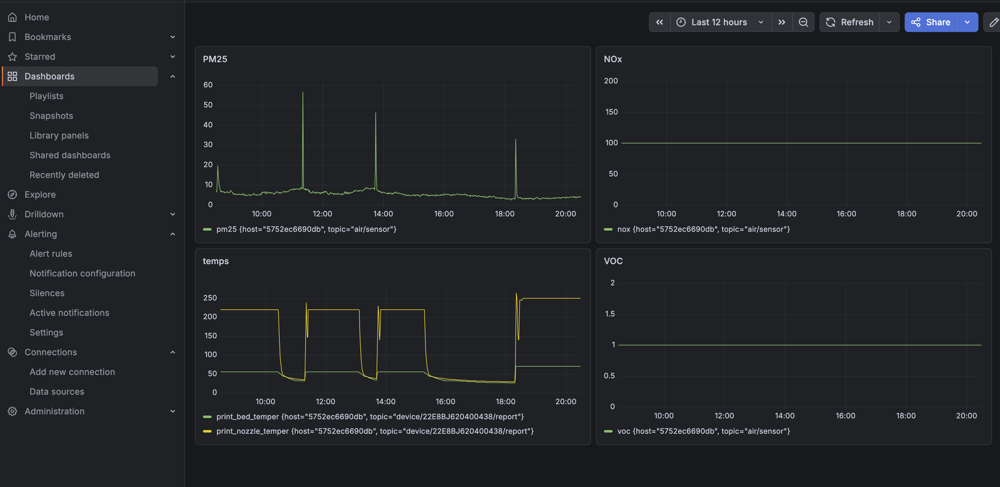

# 🌬️ DIY Air Quality Monitor with Bambu Lab Print Correlation

A self-hosted air quality monitoring station built to track how 3D printing affects indoor air. Measures PM2.5, VOC, and NOx in real time — with live correlation to Bambu Lab printer activity via its local MQTT API.

Built for a flat where a Bambu Lab P2S runs PETG and other filaments regularly.



---

## Features

- Real-time **PM2.5, PM4, PM10, PM1** via Sensirion SPS30
- **VOC Index and NOx Index** via Sensirion SGP41
- **Bambu Lab printer correlation** — overlays print progress, nozzle/bed temperature with air quality data
- **Email alerts** when air quality thresholds are exceeded
- Fully self-hosted: MQTT → Telegraf → InfluxDB → Grafana
- Runs on a Raspberry Pi with OpenMediaVault (or any Linux server with Docker)

---

## Hardware

| Component                               | Purpose                           | Approx. Cost |
| --------------------------------------- | --------------------------------- | ------------ |
| ESP32-WROOM-32U (with external antenna) | Microcontroller + WiFi            | ~$5          |
| Sensirion SPS30                         | Particulate matter (PM1/2.5/4/10) | ~$25         |
| Sensirion SGP41                         | VOC + NOx gas sensor              | ~$15         |
| External 2.4GHz antenna + U.FL cable    | Stable WiFi                       | ~$3          |
| Breadboard + dupont cables              | Prototyping                       | ~$3          |

> **Note:** For a permanent installation, solder all connections. Loose breadboard connections are a common source of crashes.

---

## Architecture

```
ESP32 (SPS30 + SGP41)
        │
        ▼ MQTT (air/sensor)
Mosquitto Broker ◄──── Bambu Lab P2S (MQTT over SSL)
        │
        ▼
    Telegraf
        │
        ▼
    InfluxDB
        │
        ▼
    Grafana (dashboards + alerts)
```

---

## Wiring

### SGP41 → ESP32 (I2C)

| SGP41 Pin | ESP32 Pin |
| --------- | --------- |
| VIN       | 3.3V      |
| GND       | GND       |
| SDA       | GPIO 21   |
| SCL       | GPIO 22   |

### SPS30 → ESP32 (I2C via JST ZH 1.5mm 5-pin cable)

| SPS30 Pin | Color (standard cable) | ESP32 Pin              |
| --------- | ---------------------- | ---------------------- |
| 1 – VDD   | Black                  | **5V (VIN)** ⚠️        |
| 2 – SDA   | Red                    | GPIO 21                |
| 3 – SCL   | White                  | GPIO 22                |
| 4 – SEL   | Yellow                 | GND (selects I2C mode) |
| 5 – GND   | Orange                 | GND                    |

> ⚠️ SPS30 requires **5V** on VDD. Both SDA/SCL lines are 3.3V compatible — no level shifter needed.
> ⚠️ Pin 1 color may vary between cable batches. Always verify pin 1 marking (triangle) on the JST connector.

Both sensors share the same I2C bus (GPIO 21/22). I2C addresses:

- SPS30: `0x69`
- SGP41: `0x59`

---

## Software Setup

### 1. Prerequisites

- Docker and Docker Compose installed on your server
- Arduino IDE with ESP32 board support

### 2. Arduino Libraries

Install via Arduino IDE → Library Manager:

- `sps30` by Paul van Haastrecht
- `Sensirion I2C SGP41`
- `Sensirion Core`
- `Sensirion Gas Index Algorithm`
- `PubSubClient`

### 3. Configure and Flash ESP32

Edit `arduino/air_monitor.ino` and set your credentials:

```cpp
const char* ssid = "YOUR_WIFI_SSID";
const char* password = "YOUR_WIFI_PASSWORD";
// ...
mqttClient.setServer("YOUR_SERVER_IP", 1883);
```

Upload to ESP32 via Arduino IDE (`Tools → Board → ESP32 Dev Module`).

### 4. Server Setup (Docker)

Copy `docker/docker-compose.yml` to your server and start services:

```bash
docker compose up -d
```

This starts:

- **Mosquitto** MQTT broker on port 1883
- **InfluxDB 2** on port 8086
- **Grafana** on port 3000
- **Telegraf** data collector

### 5. Configure Mosquitto

Allow anonymous connections (for local network use):

```bash
docker exec -it <mosquitto-container> sh
echo -e "listener 1883\nallow_anonymous true" > /mosquitto/config/mosquitto.conf
exit
docker restart <mosquitto-container>
```

### 6. Configure InfluxDB

1. Open `http://YOUR_SERVER_IP:8086`
2. Create an account, organization (e.g. `home`), and bucket (e.g. `air`)
3. Generate an API token and copy it

### 7. Configure Telegraf

Edit `config/telegraf.conf` with your InfluxDB token, organization, and bucket.

For Bambu Lab integration, add your printer's IP, serial number, and access code (found in printer Settings → Network → LAN Mode).

Restart Telegraf after any config change:

```bash
docker restart <telegraf-container>
```

### 8. Grafana Setup

1. Open `http://YOUR_SERVER_IP:3000` (default: admin/admin)
2. Add InfluxDB as a data source:
   - Query Language: **Flux**
   - URL: `http://influxdb:8086`
   - Organization, token, and default bucket from step 6
3. Create dashboards using the sample queries below

---

## Sample Grafana Queries

### PM2.5 over time

```flux
from(bucket: "air")
  |> range(start: v.timeRangeStart, stop: v.timeRangeStop)
  |> filter(fn: (r) => r._measurement == "mqtt_consumer")
  |> filter(fn: (r) => r._field == "pm25")
  |> aggregateWindow(every: 1m, fn: mean, createEmpty: false)
```

### Bambu Lab nozzle + bed temperature

```flux
from(bucket: "air")
  |> range(start: v.timeRangeStart, stop: v.timeRangeStop)
  |> filter(fn: (r) => r._measurement == "bambu")
  |> filter(fn: (r) => r._field == "print_nozzle_temper" or r._field == "print_bed_temper")
  |> aggregateWindow(every: 1m, fn: mean, createEmpty: false)
```

### Print progress

```flux
from(bucket: "air")
  |> range(start: v.timeRangeStart, stop: v.timeRangeStop)
  |> filter(fn: (r) => r._measurement == "bambu")
  |> filter(fn: (r) => r._field == "print_percent")
  |> aggregateWindow(every: 1m, fn: mean, createEmpty: false)
```

---

## Email Alerts (Grafana)

1. Add SMTP environment variables to Grafana in `docker-compose.yml`:

```yaml
environment:
  - GF_SMTP_ENABLED=true
  - GF_SMTP_HOST=smtp.gmail.com:587
  - GF_SMTP_USER=your@gmail.com
  - GF_SMTP_PASSWORD=your_app_password
  - GF_SMTP_FROM_ADDRESS=your@gmail.com
```

2. In Grafana: **Alerting → Contact points → Add contact point → Email**
3. Create alert rules using the queries below

For Gmail, generate an App Password at `https://myaccount.google.com/apppasswords`.

### Alert Queries

Use time-windowed averages to avoid false alarms from momentary spikes.

**PM2.5** — 30-minute mean (practical for 3D printing; WHO norm is 24h but too slow for episode detection):

```flux
from(bucket: "airmonitor")
  |> range(start: -30m)
  |> filter(fn: (r) => r._measurement == "mqtt_consumer")
  |> filter(fn: (r) => r._field == "pm25")
  |> mean()
```

Threshold: warning `> 15`, alarm `> 35` (µg/m³)

**VOC Index** — 15-minute mean (reacts quickly to filament/solvent emissions):

```flux
from(bucket: "airmonitor")
  |> range(start: -15m)
  |> filter(fn: (r) => r._measurement == "mqtt_consumer")
  |> filter(fn: (r) => r._field == "voc")
  |> mean()
```

Threshold: warning `> 150`, alarm `> 250`

**NOx Index** — 30-minute mean (more stable, slower to change):

```flux
from(bucket: "airmonitor")
  |> range(start: -30m)
  |> filter(fn: (r) => r._measurement == "mqtt_consumer")
  |> filter(fn: (r) => r._field == "nox")
  |> mean()
```

Threshold: warning `> 125`, alarm `> 150`

> **Why different time windows?**
> PM2.5 and NOx change slowly — a 30-minute window smooths noise without losing important trends. VOC reacts faster to short-lived events like filament off-gassing, so a 15-minute window catches episodes before they pass. Using instantaneous readings without mean() causes false alarms from single noisy data points.

---

## Known Issues & Tips

- **SPS30 not initializing on cold boot**: The sensor needs ~30s warmup. The code retries automatically. A hardware watchdog ensures recovery if the I2C bus hangs.
- **VOC baseline**: SGP41 requires ~24 hours of continuous runtime to fully calibrate VOC baseline. Every restart resets the learning algorithm.
- **WiFi stability**: ESP32 PCB antenna struggles with RSSI below -70 dBm. Use a board with an external antenna (WROOM-32U) for reliable operation.
- **SPS30 orientation**: Mount horizontally, label side up. Keep the airflow inlet/outlet unobstructed.

---

## Air Quality Reference

### WHO Air Quality Guidelines (2021)

| Pollutant | Annual mean | 24-hour mean |
| --------- | ----------- | ------------ |
| **PM2.5** | 5 µg/m³     | 15 µg/m³     |
| **PM10**  | 15 µg/m³    | 45 µg/m³     |
| **NO2**   | 10 µg/m³    | 25 µg/m³     |

> Source: [WHO Global Air Quality Guidelines 2021](https://www.who.int/publications/i/item/9789240034228)

### PM2.5 Levels

| PM2.5 (µg/m³) | Level     | Notes                                 |
| ------------- | --------- | ------------------------------------- |
| 0–5           | Excellent | Below WHO annual mean                 |
| 5–15          | Good      | Below WHO 24h guideline               |
| 15–35         | Moderate  | Exceeds WHO 24h guideline — ventilate |
| 35–75         | Poor      | EU limit for daily average            |
| >75           | Hazardous | Immediate action recommended          |

### VOC & NOx Index (Sensirion Scale)

Sensirion's Gas Index Algorithm outputs a value from 1–500 where **100 = typical clean indoor air baseline**. There is no single WHO standard for VOC as a category.

| Index   | Level                                 |
| ------- | ------------------------------------- |
| 1–50    | Excellent                             |
| 51–100  | Good (calibrating baseline)           |
| 101–200 | Moderate — increased VOC/NOx detected |
| 201–400 | Poor — ventilate                      |
| >400    | Hazardous                             |

### Recommended Alert Thresholds

Based on WHO guidelines, Sensirion documentation, and 3D printing research:

| Metric    | Typical indoor range | Warning   | Alarm     |
| --------- | -------------------- | --------- | --------- |
| PM2.5     | 0–10 µg/m³           | >15 µg/m³ | >35 µg/m³ |
| PM10      | 0–20 µg/m³           | >45 µg/m³ | >75 µg/m³ |
| VOC Index | 80–120               | >150      | >250      |
| NOx Index | 95–105               | >125      | >150      |

> **Why different thresholds for VOC and NOx?**
> VOC Index reacts to a broad range of organic compounds (solvents, filaments, cooking, cleaning products) and has more natural variation. NOx Index is much more stable in typical homes — values above 150 indicate a serious source of nitrogen oxides (combustion, heavy printing). NOx alarm threshold is set lower because elevated NOx is more immediately concerning.

### 3D Printing Context

Studies on FDM printing emissions show:

- **PLA**: relatively low emissions, typically +10–20 µg/m³ PM2.5 near the printer
- **PETG**: moderate emissions, higher VOC than PLA
- **ABS**: high emissions — significant UFP and styrene release
- **TPU**: variable, can be significant

Ventilation is strongly recommended when PM2.5 exceeds 25 µg/m³ during printing.

---

## License

MIT
